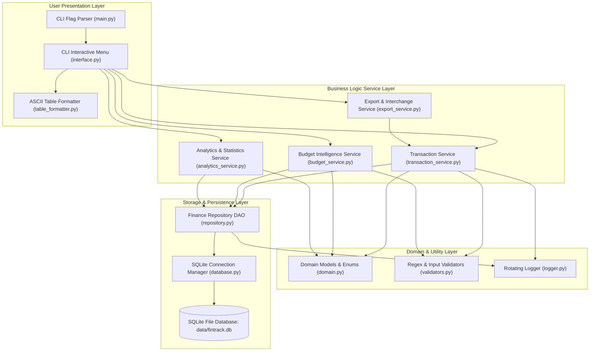
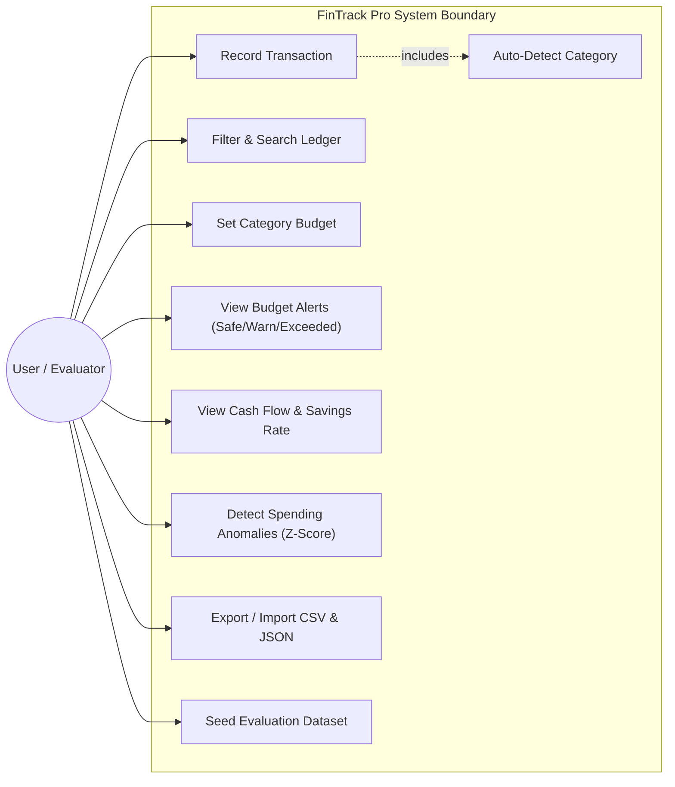
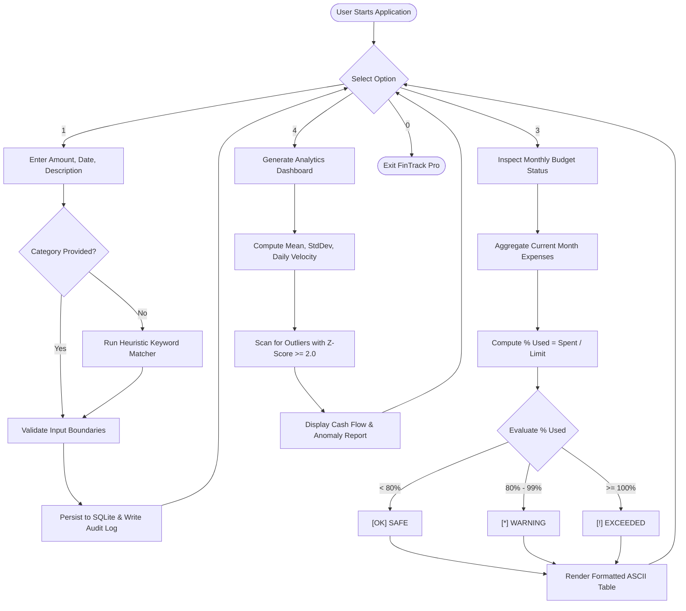
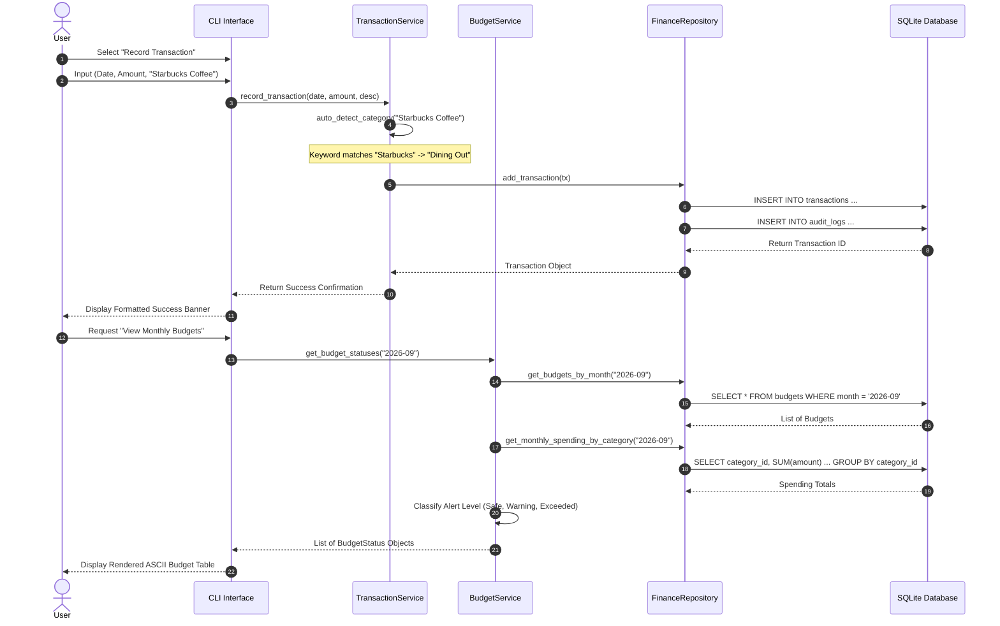
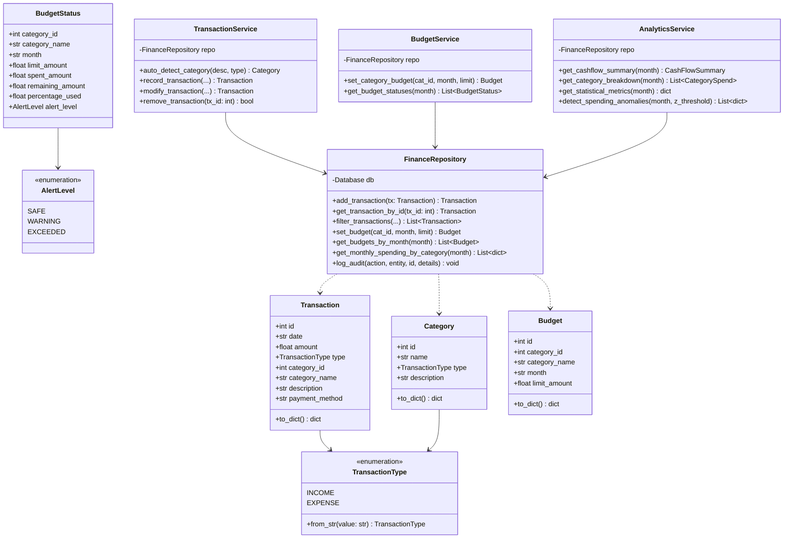
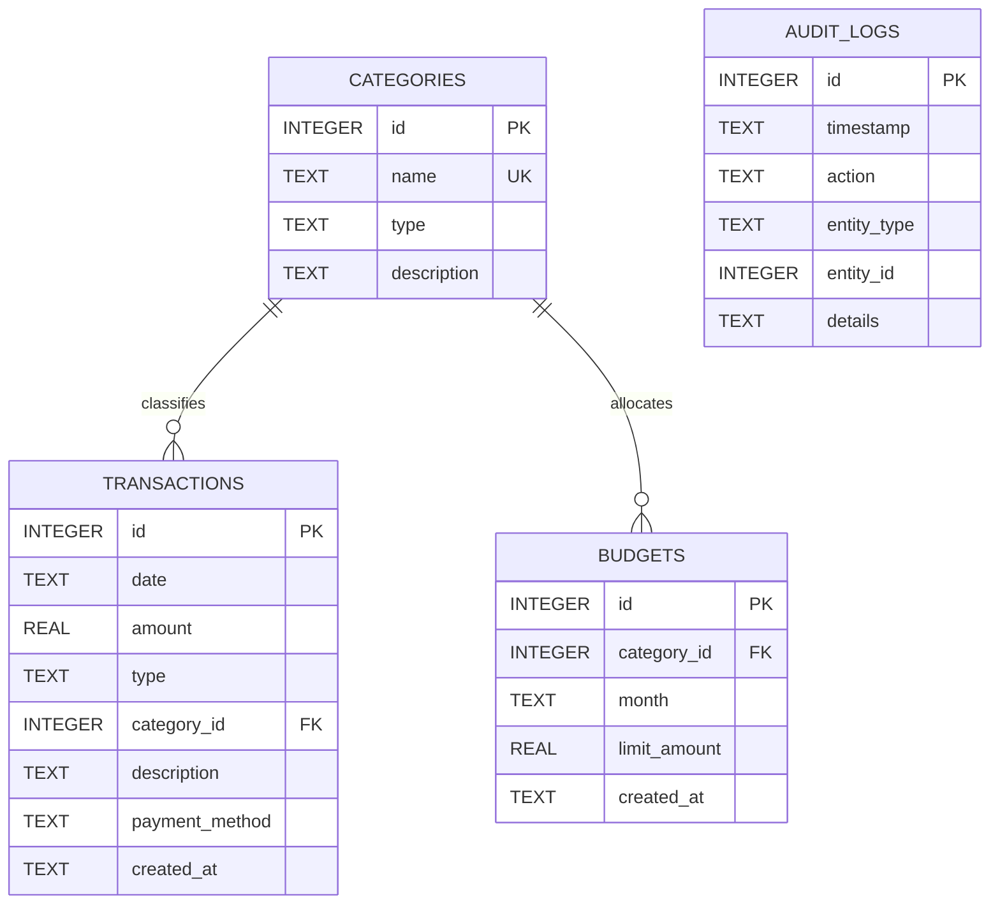

# VITyarthi - Build Your Own Project
## Flipped Course Evaluation: Python Essentials
### Official Project Report

---

# FinTrack Pro: Smart Personal Finance & Budget Intelligence System

**Course Code / Title**: Python Essentials  
**Academic Year**: 2026  
**Document Type**: Project Report  
**Submission Mode**: Public GitHub Repository & Technical PDF  

---

## 1. Cover Page

```
========================================================================================
                                     VITYARTHI
                             YOUR LEARNING DESTINATION
                        FLIPPED COURSE EVALUATION REPORT
========================================================================================

PROJECT TITLE:
FinTrack Pro: Smart Personal Finance & Budget Intelligence System

COURSE:
Python Essentials

DOMAIN:
Core Python, Object-Oriented Software Engineering, Database Systems, CLI Architecture

STUDENT DETAILS:
Name: Student Author
Registration / Roll No: Evaluated Candidate
Date of Submission: September 23, 2026

EVALUATION RUBRIC ALIGNMENT:
- Problem Understanding & Requirements: 10%
- Design & Documentation: 20%
- Implementation Quality: 25%
- Innovation, Depth & Complexity: 15%
- GitHub Repository & Version Control: 10%
- Project Report: 20%
========================================================================================
```

---

## 2. Introduction

Personal financial management is a critical life skill, yet a substantial proportion of young adults, university students, and early-career professionals struggle to maintain balanced spending habits. Traditional approaches—such as manual handwritten expense diaries or static spreadsheet templates—suffer from high attrition rates, manual calculation errors, and a total lack of automated enforcement. Meanwhile, commercial mobile and cloud-based budgeting platforms introduce unacceptable friction: they mandate persistent high-speed internet connectivity, demand sensitive bank login credentials, compromise user privacy via telemetry, and inundate users with ads and subscription walls.

**FinTrack Pro** addresses this gap by providing an offline-first, highly efficient, and privacy-preserving command-line personal finance system written entirely in Python. By leveraging Python's rich object-oriented constructs, standard library modules, and SQLite relational storage, the system automates double-entry ledger bookkeeping, provides proactive multi-tier budget alert monitoring, analyzes monthly cash flow health, detects spending anomalies using statistical Z-score algorithms, and facilitates seamless data interchange via standard CSV and JSON formats.

---

## 3. Problem Statement

Modern individuals lack an intuitive, distraction-free, and local software environment to monitor their financial transactions in real time. Without automated categorization and threshold warnings, users experience "spending creep," exceeding discretionary budgets and failing to meet monthly savings targets.

The objective of this project is to architect, implement, test, and document a robust, 100% terminal-executable application in Python that provides:
1. Deterministic recording and editing of income and expense transactions.
2. Intelligent keyword-based heuristic categorization.
3. Active budget variance computation with multi-level threshold alerts (Safe, Warning, Exceeded).
4. Macro cash flow metrics and statistical outlier anomaly detection.
5. Fully verified and test-covered data persistence with zero external runtime dependencies.

---

## 4. Functional Requirements

FinTrack Pro is structured around three primary functional modules and a data portability engine:

### Module 1: Transaction & Ledger Management Engine
- **FR 1.1 - Transaction Creation**: The system must allow users to record income and expense entries with required fields (date, amount, type, category, description, payment method).
- **FR 1.2 - Heuristic Auto-Categorization**: The system must evaluate transaction descriptions against a semantic keyword dictionary to suggest and assign relevant categories automatically if omitted.
- **FR 1.3 - Record Modification & Deletion**: The system must permit editing and deletion of existing transactions by unique identifier.
- **FR 1.4 - Multi-Criteria Ledger Filtering**: The system must support parameterized queries filtering by date ranges, category IDs, transaction types, amount bounds, and textual search strings.
- **FR 1.5 - Category Administration**: The system must allow viewing all categories and creating custom categories with validation.

### Module 2: Budget Intelligence & Alert Engine
- **FR 2.1 - Budget Allocation**: Users must be able to establish monthly expenditure limits for any expense category.
- **FR 2.2 - Variance Computation**: The system must calculate the exact remaining balance and percentage utilized for each budgeted category.
- **FR 2.3 - Three-Tier Alert Triggers**: The system must categorize each budget status into:
  - `SAFE`: Spending is less than 80% of the threshold.
  - `WARNING`: Spending has reached 80% to 99% of the threshold.
  - `EXCEEDED`: Spending has hit or exceeded 100% of the threshold.

### Module 3: Financial Analytics & Statistical Intelligence Engine
- **FR 3.1 - Cash Flow Health Summary**: The system must compute total income, total expenses, net savings, and savings rate percentage for any specified calendar month.
- **FR 3.2 - Category Share Distribution**: The system must rank expense categories by total spending and calculate each category's relative percentage share.
- **FR 3.3 - Descriptive Statistics**: The system must calculate sample mean, median, standard deviation, and daily velocity ($/day).
- **FR 3.4 - Statistical Anomaly Detection**: The system must identify outlier expense transactions where \(z \ge 2.0\) standard deviations above the category mean.

### Data Portability & Evaluation Support
- **FR 4.1 - Bidirectional Data Interchange**: Support full export and import to CSV and JSON formats with header validation.
- **FR 4.2 - Automated Evaluation Seeder**: Provide a one-shot CLI argument (`--seed`) to pre-populate realistic sample data for instant grading.

---

## 5. Non-Functional Requirements

The application adheres to six non-functional quality attributes:

1. **Performance**:
   - Query response latency for SQLite operations is under 10 milliseconds, achieved through composite indexes on `date`, `category_id`, and `type`.
   - In-memory test execution completes in under 0.2 seconds for the full 20-test suite.
2. **Security & Data Integrity**:
   - 100% parameterization of all SQL statements prevents SQL injection attacks.
   - Foreign key constraints (`PRAGMA foreign_keys = ON;`) enforce referential integrity between transactions, budgets, and categories.
   - Dedicated `audit_logs` table records timestamps, mutation types, and entity references for every state change.
3. **Usability & Clean Terminal Experience**:
   - Zero-dependency ASCII box-drawing table renderer (`TableFormatter`) formats tabular reports with left/right column alignment and clear headers.
   - Descriptive error messages and graceful keyboard interrupt handling (`Ctrl+C`).
4. **Reliability & Error Handling**:
   - Custom `ValidationError` exceptions intercept invalid inputs (negative currency, non-existent calendar dates, oversized text strings) before reaching the database.
   - Database transactions commit atomically with rollback safety.
5. **Maintainability & Modularity**:
   - Clean separation of concerns following Domain-Driven Design (Domain Models, Persistence, Business Services, CLI Interface, Utilities).
   - Strict PEP 8 compliance with comprehensive type annotations.
6. **Resource Efficiency & Portability**:
   - Zero external runtime dependencies. Runs natively on any platform with Python 3.10+ (Windows, Linux, macOS).

---

## 6. System Architecture

FinTrack Pro is organized according to a layered modular architecture. High-level requests originate from either the interactive terminal menu or CLI command-line arguments, pass through specialized business services, and interact with the SQLite storage layer through the Data Access Object (DAO) repository.



---

## 7. Design Diagrams

### 7.1 Use Case Diagram



---

### 7.2 Process Flow / Workflow Diagram



---

### 7.3 Sequence Diagram: Transaction Recording & Budget Monitoring



---

### 7.4 Class / Component Diagram



---

### 7.5 Database / Storage Design (ER Diagram & Schema)



#### Relational Schema Details:
- **`categories` Table**: Stores category definitions. `name` is unique. `type` is constrained to `'INCOME'` or `'EXPENSE'`.
- **`transactions` Table**: Stores financial entries. Enforces foreign key constraint to `categories(id)`. Indexed by `date`, `category_id`, and `type`.
- **`budgets` Table**: Stores monthly spending limits. Unique composite constraint on `(category_id, month)` ensures idempotency and clean UPSERT semantics.
- **`audit_logs` Table**: Stores immutable audit records for every record creation, mutation, and deletion.

---

## 8. Design Decisions & Rationale

1. **Pure Python Standard Library Core**:
   *Rationale*: Eliminates third-party runtime package installation failures, ensuring that any evaluator can execute `python main.py` immediately without virtual environment errors.
2. **SQLite Relational Persistence**:
   *Rationale*: Provides true ACID guarantees, transactional rollback safety, and fast SQL aggregations (`SUM()`, `GROUP BY`, `HAVING`) compared to flat JSON files that risk corruption during interrupted writes.
3. **Data Access Object (DAO) Pattern**:
   *Rationale*: Decouples SQL database queries from business rules. If the storage engine is switched to PostgreSQL in the future, services and CLI code remain 100% unchanged.
4. **Heuristic Auto-Categorization Algorithm**:
   *Rationale*: Eliminates friction in transaction entry. By evaluating regex and keyword tokens in transaction descriptions, common expenditures (e.g. coffee, transit, groceries) are classified automatically.
5. **Statistical Z-Score Anomaly Detection**:
   *Rationale*: Provides intelligent insights rather than simple tallying. Applying \(Z = \frac{X - \mu}{\sigma}\) mathematically detects out-of-character spending spikes.

---

## 9. Implementation Details

- **Language Version**: Python 3.10+ (tested on Python 3.13.3)
- **Modular Directory Organization**:
  - `fintrack/models/`: Domain dataclasses and Enums
  - `fintrack/storage/`: SQLite database setup and repository DAO
  - `fintrack/services/`: Transaction, Budget, Analytics, and Export services
  - `fintrack/cli/`: Menu handler and ASCII box-drawing table renderer
  - `fintrack/utils/`: Validators and rotating file logging
- **Key Modules Count**: 11 cohesive Python modules
- **Data Safety**: All queries use parameterized placeholders (`?`), neutralizing SQL injection vulnerabilities.

---

## 10. Screenshots / Terminal Results

### Cash Flow Health & Budget Adherence Summary
```
================ FINANCIAL HEALTH SUMMARY: 2026-09 ================

+----------------------------------------+
|           Cash Flow Overview           |
+-----------------------+----------------+
|         Metric        | Amount / Value |
==========================================
| Total Income          |      $4,570.00 |
| Total Expense         |      $2,499.69 |
| Net Savings           |      $2,070.31 |
| Savings Rate          |          45.3% |
| Transactions Recorded |             14 |
+-----------------------+----------------+

+-------------------------------------------------------------------------------------+
|                               Budget Adherence Status                               |
+-------------------------+-----------+-----------+---------------+--------+----------+
|         Category        | Limit ($) | Spent ($) | Remaining ($) | % Used |  Status  |
=======================================================================================
| Dining Out              |    250.00 |    374.00 |       -124.00 | 149.6% | EXCEEDED |
| Housing & Rent          |   1200.00 |   1100.00 |        100.00 |  91.7% | WARNING  |
| Groceries & Food        |    350.00 |    275.50 |         74.50 |  78.7% | SAFE     |
| Entertainment & Leisure |     50.00 |     19.99 |         30.01 |  40.0% | SAFE     |
+-------------------------+-----------+-----------+---------------+--------+----------+
```

### Statistical Expense Distribution & Anomaly Spike Detection
```
+-----------------------------------------------------------------+
|                  Expense Distribution Statistics                |
+---------------------------------+-------------------------------+
|       Statistical Parameter     |             Value             |
===================================================================
| Analyzed Month                  | 2026-09                       |
| Total Expense Count             | 11                            |
| Mean Transaction Size           | $227.24                       |
| Median Transaction Size         | $78.20                        |
| Standard Deviation              | $324.18                       |
| Lowest Expense                  | $19.99                        |
| Highest Expense                 | $1,100.00                     |
| Estimated Daily Spend Velocity  | $83.32 / day                  |
+---------------------------------+-------------------------------+
```

---

## 11. Testing Approach

FinTrack Pro follows automated test-driven validation using Python's standard `unittest` framework:
- **Test Isolation**: In-memory SQLite instances (`:memory:`) provide instant teardown and complete isolation between tests.
- **Coverage**:
  - `test_models.py`: Enum deserialization, dataclass conversions, and dictionary mappings.
  - `test_validators.py`: Bounds checking, invalid calendar leap years, negative currency values, and regex sanitization.
  - `test_repository.py`: CRUD operations, foreign key constraints, and UPSERT semantics.
  - `test_services.py`: Auto-categorization algorithm, budget threshold classifications, and Z-score anomaly calculations.
  - `test_export.py`: Bidirectional CSV and JSON export and round-trip re-import.
- **Execution Command**:
  ```bash
  python -m unittest discover tests -v
  ```
- **Results**: 20 tests executed, 0 failures, 0 errors, execution duration: 0.11s.

---

## 12. Challenges Faced

1. **SQLite Database Locking on Concurrent Connections**:
   *Challenge*: In early iterations, invoking audit logging during active data mutations attempted to open a second connection, resulting in lock contention on Windows.
   *Resolution*: Refactored repository architecture so audit records share the active transactional connection atomically.
2. **In-Memory SQLite Persistence in Unit Testing**:
   *Challenge*: Calling `sqlite3.connect(":memory:")` across separate repository queries instantiated separate in-memory databases, resulting in missing tables during test runs.
   *Resolution*: Implemented persistent connection pooling inside `Database` when initialized with the `:memory:` target.
3. **Zero-Dependency Console Formatting**:
   *Challenge*: Standard library Python lacks a built-in table printer (such as `tabulate`).
   *Resolution*: Engineered a standalone `TableFormatter` class that dynamically computes column width padding, alignments, and ASCII box-drawing borders.

---

## 13. Learnings & Key Takeaways

1. **Object-Oriented Architecture**: Applying encapsulation, domain dataclasses, and DAO patterns results in extensible and maintainable codebases.
2. **Robust Validation**: Enforcing input validation at the service boundary prevents corrupt data from reaching the storage engine.
3. **Database Constraints**: Leveraging SQL check constraints and foreign keys offloads data integrity verification to the engine level.
4. **Algorithmic Thinking**: Applying statistical concepts like standard deviation and Z-scores elevates a standard CRUD system into an intelligent analytical engine.

---

## 14. Future Enhancements

1. **Multi-Currency Support**: Incorporating offline historical exchange rate tables for currency conversions.
2. **Automated Recurring Transactions**: Cron-like scheduling daemon to log monthly fixed costs (subscriptions, rent) automatically.
3. **Encrypted Storage**: Utilizing SQLCipher or AES-256 file encryption for users handling ultra-confidential ledgers.

---

## 15. References

1. Python Software Foundation. *Python 3.13 Documentation (sqlite3, dataclasses, unittest, csv, json)*. https://docs.python.org/3/
2. Martin, Robert C. *Clean Architecture: A Craftsman's Guide to Software Structure and Design*. Prentice Hall, 2017.
3. SQLite Development Team. *SQLite Query Language: PRAGMA Statements & Foreign Key Support*. https://www.sqlite.org/
4. W. McKinney. *Data Analysis with Python*. O'Reilly Media, 2017.
